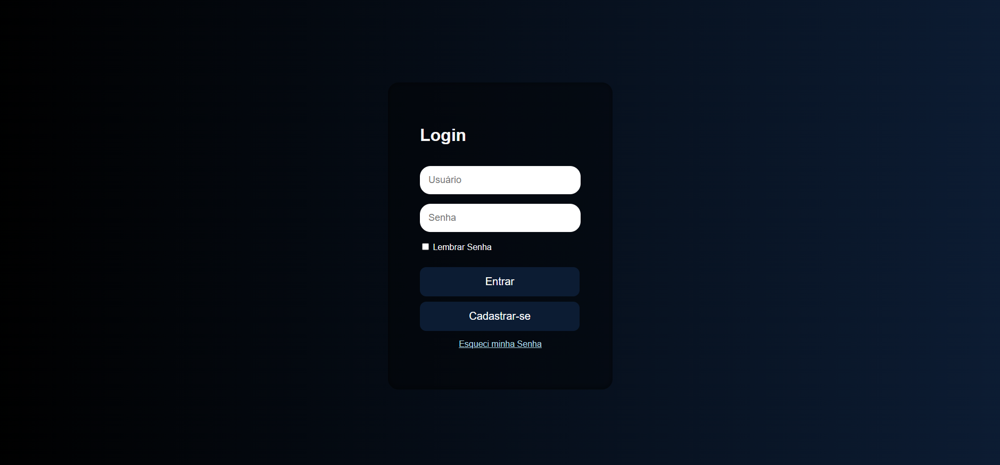
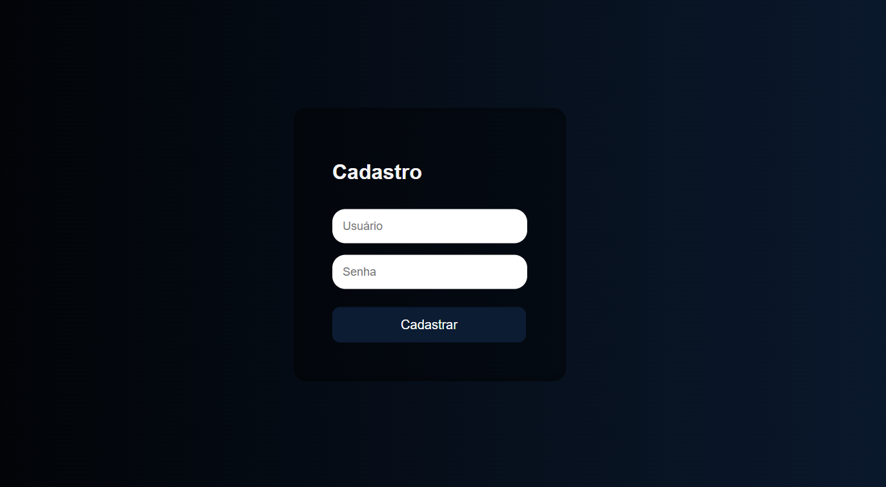
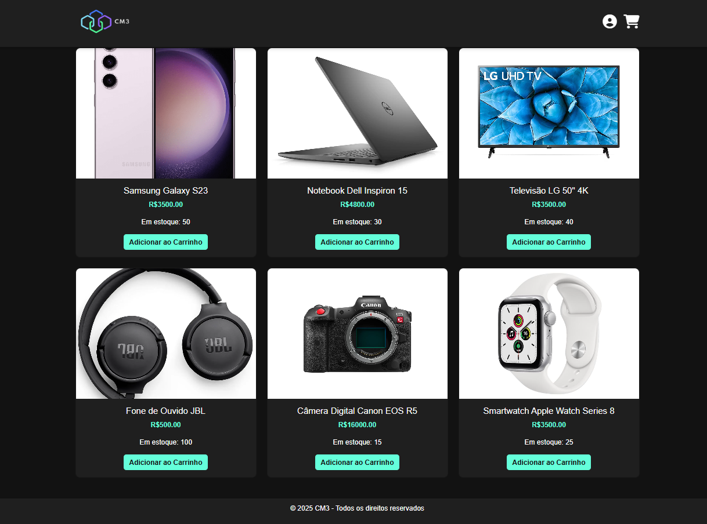
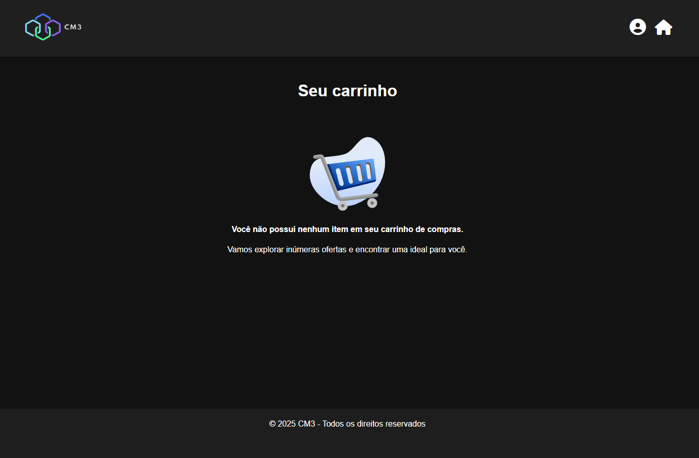

# CM3 Shop
CM3 Shop é uma **loja fictícia** desenvolvida para fins educativos e experimentais. O projeto simula uma plataforma de e-commerce, permitindo que os usuários interajam com uma interface que inclui navegação por produtos, adição ao carrinho e processo de "checkout", embora não realize transações reais. O foco é fornecer uma experiência de simulação de compras online, com ênfase no design e na funcionalidade do sistema.


## Catálogo

- [Funcionalidades](#funcionalidades)
- [Galeria](#galeria)
- [Compatibilidade](#compatibilidade)
- [Como usar](#como-usar)
  - [Instalação e Execução](#instalação-e-execução)
- [Desinstalação](#desinstalação)
- [Dependências](#dependências)

## Funcionalidades
* **Página de Produtos**: Exibe uma lista de produtos fictícios com suas respectivas descrições e preços.
* **Carrinho de Compras**: Permite adicionar, remover ou atualizar a quantidade de produtos no carrinho de compras.
* **Interface Intuitiva**: Navegação simples e visualmente atraente, com foco em uma experiência de usuário agradável.
* **Responsividade**: O design é adaptável para diferentes dispositivos, como desktop, tablet e celular

## Galeria
<details><summary><b>Login</b></summary>
   

*Página de login, aonde você pode se cadastrar ou entrar.*
</details>

<details><summary><b>Cadastro</b></summary>
   

*Página de cadastro, quando cadastrado, seus dados vão para o banco de dados.*
</details>

<details><summary><b>Início</b></summary>
   

*Interface inicial do webiste, aonde você vê os produtos*
</details>

<details><summary><b>Carrinho</b></summary>
   

*Interface do Carrinho, no momento, sem itens.*
</details>

## Compatibilidade

- **Navegadores**: Compatível com os principais navegadores modernos, como Google Chrome, Mozilla Firefox, Microsoft Edge e Safari.
- **Plataformas**: Funciona em Windows, macOS e Linux, desde que haja um navegador compatível.
- **Dispositivos**: Totalmente responsivo, funciona bem em desktop, tablet e celulares.

## Como usar

### Instalação e Execução

1. **Clone o repositório** ou baixe o projeto diretamente para sua máquina.
   
   Para clonar o repositório, use o seguinte comando no terminal:
   ```bash
   git clone https://github.com/esboinski/cm3-shop.git

2. Configure um servidor local:
    - Você precisará de um servidor local para rodar a loja fictícia. Recomendamos o uso de XAMPP, WAMP, ou outro servidor que forneça suporte para PHP e MySQL.
    - Após instalar o servidor local, inicie o Apache e o MySQL pelo painel de controle do XAMPP/WAMP.

3. Importe o banco de dados:

    * Dentro do repositório, vá para a pasta **database** e encontre o arquivo ``projeto.sql``.
    * Acesse o phpMyAdmin (geralmente disponível em http://localhost/phpmyadmin).
    * Importe o arquivo ``projeto.sql`` para o banco de dados através do phpMyAdmin.

4. Configuração do servidor:

    - Coloque os arquivos do projeto na pasta htdocs (para XAMPP) ou equivalente no servidor que você estiver utilizando.
    - Acesse o projeto no navegador digitando:

```bash
http://localhost/cm3-shop/website
````
Isso abrirá a loja fictícia no seu navegador local.

5. Interação com a loja:
    - Navegue pelas categorias de produtos, visualize os detalhes de cada um e adicione-os ao "carrinho" (lembrando que a loja é fictícia e não realiza transações reais).

## Desinstalação

Caso deseje remover o projeto da sua máquina ou ambiente local, siga os passos abaixo:

1. **Excluir os arquivos do projeto**:
   - Vá até a pasta onde o repositório foi clonado ou extraído.
   - Exclua a pasta do projeto `cm3-shop` para remover todos os arquivos do repositório.

2. **Remover o banco de dados**:
   - Se você usou um servidor como XAMPP ou WAMP, abra o **phpMyAdmin** e exclua o banco de dados.
   - Acesse **phpMyAdmin** através do navegador (`http://localhost/phpmyadmin`), selecione o banco de dados e clique na opção para excluir.

3. **Desinstalar o servidor local (opcional)**:
   - Se você não precisar mais do servidor local (XAMPP, WAMP, etc.), pode desinstalá-lo através do painel de controle do seu sistema operacional ou desinstalador fornecido.

Após seguir esses passos, todos os arquivos e configurações associadas ao projeto terão sido removidos da sua máquina.

## Dependências

Para que o projeto funcione corretamente, é necessário ter as seguintes dependências instaladas:

### 1. **Servidor Local (XAMPP, WAMP, MAMP, etc.)**
   - **Descrição**: Um servidor local é necessário para executar o banco de dados MySQL e hospedar os arquivos do projeto em seu ambiente local.
   - **Requisitos**:
     - [XAMPP](https://www.apachefriends.org/index.html) (Windows, Linux, macOS)
     - [WAMP](https://www.wampserver.com/en/) (Windows)
     - [MAMP](https://www.mamp.info/en/) (macOS)
   - **Instalação**: Baixe e instale qualquer um dos servidores locais citados acima para configurar o ambiente de servidor web e banco de dados local.

### 2. **MySQL**
   - **Descrição**: O MySQL é o banco de dados usado no projeto para armazenar informações do site.
   - **Requisitos**: O MySQL já está incluído no XAMPP/WAMP/MAMP, portanto, após instalar qualquer um desses, você terá o MySQL disponível.

### 3. **PHP** (via XAMPP/WAMP/MAMP)
   - **Descrição**: O PHP é utilizado para processamento no lado do servidor.
   - **Requisitos**: Caso esteja utilizando XAMPP, WAMP ou MAMP, o PHP já estará instalado e configurado automaticamente.
   - **Versão recomendada**: 7.4 ou superior.

### 4. **Editor de Texto (opcional)**
   - **Descrição**: Para editar e modificar os arquivos do projeto.
   - **Recomendações**:
     - [Visual Studio Code](https://code.visualstudio.com/) (Windows, macOS, Linux)
     - [Sublime Text](https://www.sublimetext.com/) (Windows, macOS, Linux)

Com essas dependências corretamente instaladas, você estará pronto para rodar o projeto em seu ambiente local.
